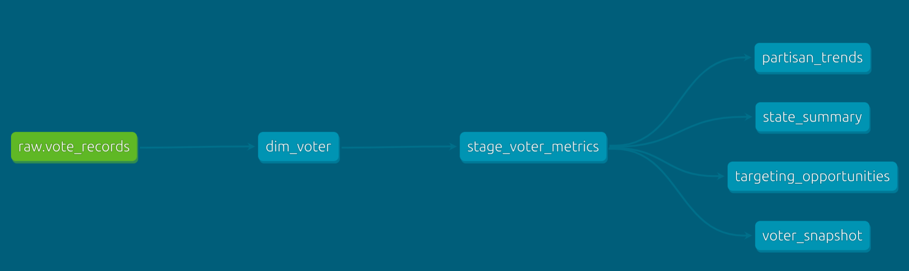

# Voter Analytics dbt Project

Production data transformation pipeline converting raw voter registration data into analytics-ready tables for campaign strategy and voter engagement analysis.

## Architecture

**Medallion Design**: Raw → Dimension → Staging → Mart

```
raw.vote_records (CSV ingestion)
    ↓
dim_voter (deduplication, validation)
    ↓
stage_voter_metrics (enrichment, segmentation)
    ↓
mart.* (4 aggregated analytics tables)
```



## Mart Tables

### `mart_voter_snapshot`

**Purpose**: Current-state demographic cross-tabs  
**Grain**: State × Age × Gender × Party × Engagement Segment  
**Use**: "Show me voter composition and engagement by demographics"

```sql
-- Example: Current engagement by state and party
SELECT state, party, pct_current_voters, pct_targetable_voters
FROM mart_voter_snapshot
ORDER BY pct_targetable_voters DESC;
```

### `mart_partisan_trends`

**Purpose**: Time series of partisan composition across election cycles  
**Grain**: Year × Type × State × Demographics × Party  
**Use**: "Track Democratic participation in PA over presidential cycles"

```sql
-- Example: Trend analysis
SELECT election_year, election_type, state, participation_rate
FROM mart_partisan_trends
WHERE party = 'Democrat' AND state = 'PA'
ORDER BY election_year DESC;
```

### `mart_targeting_opportunities`

**Purpose**: Ranked segments for voter re-engagement campaigns  
**Grain**: State × Age × Gender × Party (with composite scoring)  
**Use**: "Identify top 20 segments for GOTV outreach"

```sql
-- Example: High-priority targets
SELECT state, age_group, gender, party, opportunity_score, prime_target_voters
FROM mart_targeting_opportunities
WHERE targeting_tier = 'High Priority'
ORDER BY opportunity_score DESC LIMIT 20;
```

### `mart_state_summary`

**Purpose**: Executive-level geographic competitive analysis  
**Grain**: State aggregations with partisan lean  
**Use**: "Show me competitive states with high engagement opportunities"

```sql
-- Example: Competitive state analysis
SELECT state, partisan_lean, engagement_opportunity_score, total_registered_voters
FROM mart_state_summary
WHERE partisan_lean IN ('Highly Competitive', 'Competitive')
ORDER BY engagement_opportunity_score DESC;
```

## Key Metrics

### Voter Engagement Segments

- **Current Voter**: Participated in most recent election (0 missed)
- **Missed Last Election**: Skipped 1 recent election
- **Occasional Voter**: Missed 2-3 elections
- **Infrequent Voter**: Missed 4-6 elections
- **Dormant Voter**: Missed 7+ elections
- **Never Voted**: No voting history

### Targeting Tiers

- **High Priority**: Opportunity score ≥25, segment ≥100 voters
- **Medium Priority**: Score ≥15, segment ≥50 voters
- **Low Priority**: Score ≥8, segment ≥25 voters
- **Monitor Only**: Below thresholds

### Opportunity Scoring

Composite 0-100 scale weighting:

- Recent lapsers (40%)
- Medium lapsers (30%)
- Registration tenure (20%)
- Segment size (10%)

## Technical Features

### Incremental Processing

- `stage_voter_metrics` processes only new/modified records
- `dim_voter` uses `source_id` as unique key
- Timestamp-based change detection

### Data Quality

- **dbt-expectations** package for advanced testing
- **Contract enforcement** on all mart models
- **Referential integrity** between dimensions and facts
- **Regex validation** for emails and state codes
- **Range validation** for dates and percentages

### Design Decisions

- **Age groups**: Aligned with Pew Research political demographics
- **Party simplification**: Three major categories (Democrat, Republican, Independent)
- **Election calendar**: Hardcoded federal dates (2008-2024) via macro
- **Behavioral segmentation**: Based on federal election participation

## Quick Start

```bash
# Install dependencies
dbt deps

# Run pipeline
dbt run

# Test data quality
dbt test

# Generate documentation
dbt docs generate
dbt docs serve
```

## Customization

### Modify Engagement Segments

Edit logic in `stage_voter_metrics.sql`:

```sql
CASE
    WHEN elections_since_last_vote = 0 THEN 'Current Voter'
    WHEN elections_since_last_vote = 1 THEN 'Missed Last Election'
    -- etc.
END
```

### Adjust Opportunity Weights

Modify scoring in `mart_targeting_opportunities.sql`:

```sql
-- Current: Recent (40%), Medium (30%), Tenure (20%), Size (10%)
ROUND(
    (40.0 * lapsed_1_election / total_voters) +
    (30.0 * (lapsed_2_3_elections + lapsed_4_6_elections) / total_voters) +
    -- etc.
, 2) as opportunity_score
```

## Roadmap

### Phase 2: Enhanced Dimensions

- State dimension with geographic/economic context
- Expanded gender categories
- Dynamic election calendar via API
- Household clustering

### Phase 3: Advanced Analytics

- Predictive turnout models
- Cohort lifecycle analysis
- Geographic clustering
- Campaign effectiveness tracking

### Phase 4: Real-time Operations

- Streaming incremental updates
- Change data capture
- Automated anomaly detection
- API layer for applications

## Data Governance

### Privacy

- PII minimization (emails only, consider hashing)
- Automated retention policies
- Role-based access control
- Comprehensive audit logging

### Compliance

- GDPR (right to deletion, portability)
- CCPA (California privacy requirements)
- Election law adherence
- Political data usage restrictions

## Resources

- **Full schema documentation**: `models/schema.yml`
- **Data quality tests**: `tests/`
- **Macro library**: `macros/simple_elections_since_last_vote.sql`
- **Seed data**: `seeds/` (MIT historic + Google Civic upcoming)

---

```bash
Note: This README was generated automatically using Claude.ai
```
